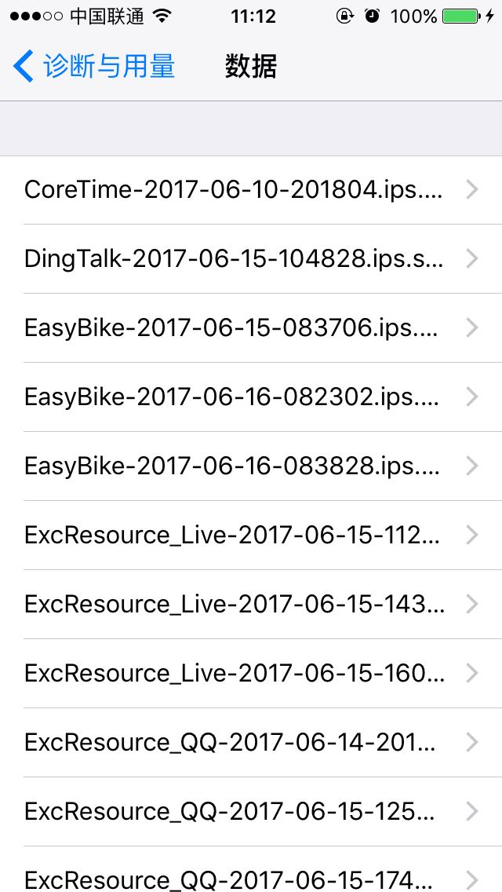

### 前提
应用崩溃影响用户体验，所以减少iOS应用奔溃是提高应用质量的重要途径。

## 一、获取iOS应用 crash信息
### 1,通过itunes同步
- 1，iOS设备上的应用闪退时, 操作系统会声称一个崩溃日志, 保存在设备上。
 
``` 
路径是:  设置 -> 隐私 ->诊断与用量 ->诊断与用量数据。在这里可以看到设备上所有的设备崩溃日志.
在“诊断与用量”界面，建议用户选择自动发送，这样可以每天自动发送诊断和用量数据到itunes，来帮助开发者分析崩溃.
```  



- 2，设备与电脑上的ITunes Store同步后, 会将崩溃日志保存在电脑上,崩溃日志保存在以下位置:  
  
```
Mac OSX :~/Library/Logs/CrashReporter/MobileDevice/ 
可以看到所有和该电脑同步过的设备的崩溃日志(.crash文件)
```

### 2，使用Xcode
- 1，code的Window菜单下的organizer，然后点击Devices tab，然后选中左边的Device Logs。选中某一个崩溃日志，点击Export Log可导出崩溃日志(.crash文件)


- 2,通过Xcode 获取appStore上架应用的crash信息。


### 3，其他方式获取部分堆栈信息
- 1，通过代码获取应用的crash堆栈信息，然后下次启动时上传服务器获得日志信息。
- 2，通过友盟等第三方SDK拿到应用crash部分堆栈信息。
这种方式获取的应用信息都只有部分堆栈信息

## 二，获取应用的符号表
#### 1，日志文件
获取日志信息后，需要对堆栈调用信息分析


crash调用堆栈信息如图，有4列：第1列是栈顺序；第2列是二进制包名；第3列是运行地址；第四列是函数的动态加载地址，即加号前面的地址。
#### 2，dSYM文件
在Xcode每次Archives的是都会生成dSYM文件，所有每次打包的时候的都需要保留包文件。点击.xcarchive文件，显示包含内容，在该目录下有生成的dSYM文件。dSYM文件也是Mach-o格式，Mach-O格式全称为Mach Object文件格式的缩写，是mac上可执行文件的格式，类似于windows上的PE格式 (Portable Executable ), Linux上的elf格式 (Executable and Linking Format)。  
Mach-O可以分为3个部分

- (1)Header
- (2)Segment
- (3)section
header后面是segment，然后再跟着section，而一个segment是可以包含多个section的。MachOview工具可以可视化查看Mach-O文件格式，我们把dSYM文件放入可视化工具:


该dSYM文件包含armv7和arm64两种架构的符号表。其中arm64的偏移地址时835520

#### 3，UUID
每一个可执行程序都有一个build UUID来唯一标识。Crash日志包含发生crash的这个应用（app）的 build UUID以及crash发生的时候，应用加载的所有库文件的[build UUID]。UUID用来确定二进制包唯一标识

- 查看日志文件的UUID

```
localhost:Test guogunhua$ grep "crashTest arm64" crashTest2017.crash 
0x1000cc000 - 0x1000d3fff crashTest arm64  <87f22ef6f56d3c7fac969d3416cd328a> /var/containers/Bundle/Application/13B84A6F-FB06-484B-8573-9390559A4A71/crashTest.app/crashTest
```
或者

```
localhost:Test guogunhua$ grep --after-context=2 "Binary Images:" crashTest2017.crash 
Binary Images:
0x1000cc000 - 0x1000d3fff crashTest arm64  <87f22ef6f56d3c7fac969d3416cd328a> /var/containers/Bundle/Application/13B84A6F-FB06-484B-8573-9390559A4A71/crashTest.app/crashTest
0x100124000 - 0x100153fff dyld arm64  <f54ed85a94253887886a8028e20ed8ba> /usr/lib/dyld
```
其中 0x1000cc000 就是模块的加载地址。

- 查看二进制文件的UUID,dSYM文件

```
localhost:Test guogunhua$ xcrun dwarfdump --uuid dSYMs/crashTest.app.dSYM/Contents/Resources/DWARF/crashTest 
UUID: 6D16D164-DA42-31C8-8890-94895DB43C47 (armv7) dSYMs/crashTest.app.dSYM/Contents/Resources/DWARF/crashTest
UUID: 87F22EF6-F56D-3C7F-AC96-9D3416CD328A (arm64) dSYMs/crashTest.app.dSYM/Contents/Resources/DWARF/crashTest
```
或者appName.app／appName文件

```
localhost:Test guogunhua$ xcrun dwarfdump --uuid Products/Applications/crashTest.app/crashTest 
UUID: 6D16D164-DA42-31C8-8890-94895DB43C47 (armv7) Products/Applications/crashTest.app/crashTest
UUID: 87F22EF6-F56D-3C7F-AC96-9D3416CD328A (arm64) Products/Applications/crashTest.app/crashTest
```
需要三者的UUID的匹配才能正确的符号化。即都是：```87F22EF6-F56D-3C7F-AC96-9D3416CD328A```

## 三，符号化iOS Crash堆栈
我们拿到的crash信息是堆栈调用信息，所有信息都是16进制的内存地址，不能分析应用crash的原因，需要符号化才能分析。
### 1，使用Xcode
对于已经上架了appStore的应用的来说，crash文件通过用户上传到苹果服务器，Xcode可以直接下载下来，看到堆栈符号化的堆栈信息就和开发调试一样方便。  


### 2, symbolicatecrash
symbolicatecrash是Xcode带的独立工具，可以拷贝出来使用。查找位置  

```
localhost:~ guogunhua$ find /Applications/Xcode.app -name symbolicatecrash -type f
/Applications/Xcode.app/Contents/SharedFrameworks/DVTFoundation.framework/Versions/A/Resources/symbolicatecrash

``` 
把symbolicatecrash和奔溃日志，APP对应的.dSYM文件放在同一文件夹下，执行如下命令：

```
Symbolicatecrash + 崩溃日志.crash + APP对应的.dSYM文件 + > + 输出到的文件，
或者
Symbolicatecrash + 崩溃日志.crash + appName.app/appName + > + 输出到的文件，
如：
localhost:Test guogunhua$ ./symbolicatecrash crashTest2017.crash Products/Applications/crashTest.app/crashTest > aa.log
```
符号化前

```
Last Exception Backtrace:
0   CoreFoundation                	0x1843391b8 __exceptionPreprocess + 124
1   libobjc.A.dylib               	0x182d7055c objc_exception_throw + 56
2   CoreFoundation                	0x1842147f4 -[__NSArrayI objectAtIndex:] + 184
3   crashTest                     	0x1000d0904 0x1000cc000 + 18692
4   crashTest                     	0x1000d0864 0x1000cc000 + 18532
5   UIKit                         	0x18a1ee924 -[UIViewController loadViewIfRequired] + 1056
6   UIKit                         	0x18a1ee4ec -[UIViewController view] + 28
7   UIKit                         	0x18a1f4c98 -[UIWindow addRootViewControllerViewIfPossible] + 76
8   UIKit                         	0x18a1f2138 -[UIWindow _setHidden:forced:] + 272

```
symbolicatecrash 符号化后

```
Last Exception Backtrace:
0   CoreFoundation                	0x1843391b8 __exceptionPreprocess + 124
1   libobjc.A.dylib               	0x182d7055c objc_exception_throw + 56
2   CoreFoundation                	0x1842147f4 -[__NSArrayI objectAtIndex:] + 184
3   crashTest                     	0x1000d0904 -[ViewController crashTest] (ViewController.m:29)
4   crashTest                     	0x1000d0864 -[ViewController viewDidLoad] (ViewController.m:22)
5   UIKit                         	0x18a1ee924 -[UIViewController loadViewIfRequired] + 1056
6   UIKit                         	0x18a1ee4ec -[UIViewController view] + 28
7   UIKit                         	0x18a1f4c98 -[UIWindow addRootViewControllerViewIfPossible] + 76
8   UIKit                         	0x18a1f2138 -[UIWindow _setHidden:forced:] + 272
```

可以看到第3，4行已经符号化了，显示了哪个文件具体行数，对应代码


查看源码，找出代码crash的原因就容易的多了。但使用symbolicatecrash工具有很大的限制

- 只能分析官方格式的崩溃日志，需要从具体的设备中导出，获取和操作都不是很方便
- 符号化的结果也是没有具体的行号信息的，也经常会出现符号化失败的情况。
- 实际上, Xcode的Organizer内置了symbolicatecrash工具，所以开发者才可以直接看到符号化的崩溃堆栈日志。

### 3，使用命令行工具atos
命令格式：

```
 atos -o executable -arch architecture -l loadAddress address 
```
说明：  

- executable dYSM文件或二进制执行文件appName.app/appName
- loadAddress 表示函数的动态加载地址，对应崩溃地址堆栈中 + 号前面的地址，即0x1000cc000
- address 表示运行时地址、对应崩溃地址堆栈中第一个地址，即0x1000d0904  ，实际上，崩溃地址堆栈中+号前后的地址相加即是运行时地址，即0x1000cc000 + 18692= 0x1000d0904
- 执行命令查询地址的符号，可以看到如下结果：
```
-[ViewController crashTest] (in crashTest) (ViewController.m:29)
```

## 四，总结
本文分析了如何获取用户的.crash文件，以及如何符号化的方法，对于分析应用crash很适用。